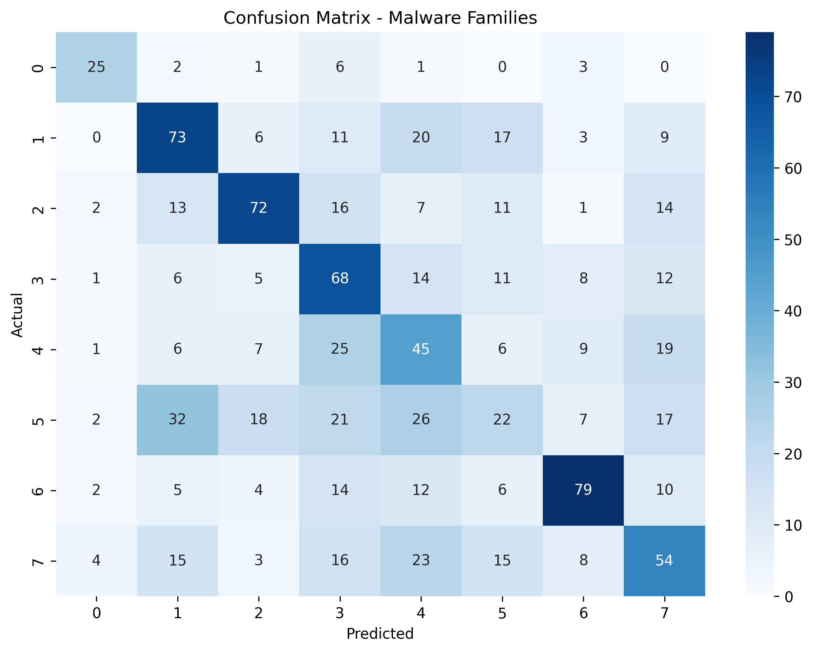
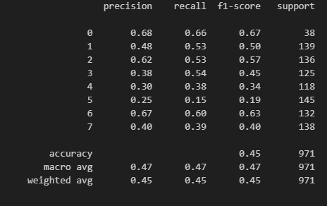

# Malware Behavior Classification Using LSTM

## Overview
I built a **behavior-based malware classification system** using sequential API call data.  
Instead of asking “Is this malware?”, I tackled the harder problem:  

**Can we classify malware into families based on their API call sequences?**  

I preprocessed real malware samples, handled noisy variable-length sequences, and modeled temporal dependencies using an **LSTM neural network**.

---

## Table of Contents
1. [Problem Statement](#problem-statement)  
2. [Dataset](#dataset)  
3. [Preprocessing](#preprocessing)  
4. [Exploratory Analysis](#exploratory-analysis)  
5. [Modeling](#modeling)  
6. [Training & Evaluation](#training--evaluation)  
7. [Results](#results)  
8. [Insights](#insights)  
9. [Limitations & Next Steps](#limitations--next-steps)  
10. [Usage](#usage)  

---

## Problem Statement
Most malware ML projects stop at static signatures. I wanted to go deeper:  
- Identify malware families based on **runtime behavior**, not just detection  
- Support security teams by providing **family-level classification**  
- Handle **variable-length sequences** and **behavioral overlaps**  

If we don’t solve this, malware classification will remain superficial, missing subtle patterns that distinguish families.

---

## Dataset
- **Source:** [GitHub – malware_api_class](https://github.com/ocatak/malware_api_class?tab=readme-ov-file)  
- **Structure:**  
  - Each row = one malware sample's API call sequence  
  - Labels = malware family  
- **Size:** 1,000+ sequences (variable length)  
- **Classes:** 8 malware families  
- **Challenges:**  
  - Noisy, variable-length sequences  
  - Duplicate and repeated API calls  
  - Imbalanced class distribution  

---

## Preprocessing
I applied the following steps:  
1. Removed duplicates  
2. Collapsed consecutive repeated API calls  
3. Converted API calls to **integer tokens** using `Tokenizer`  
4. Padded sequences to `max_len = 400`  
5. Converted labels to numeric codes  

Output:  
- `preprocessed_dataset.csv` – cleaned sequences + labels  
- `malware_sequences_int.csv` – tokenized integer sequences  

---

## Exploratory Analysis
- Checked **sequence length distribution** to determine padding requirements  
- Examined **API call frequencies** per malware family  
- Analyzed **class imbalance**  
- Observed **behavioral overlaps** between families  

**Key insights:**  
- Some malware families share API call patterns  
- Dataset requires class weighting to prevent bias during training  

---

## Modeling
**Model choice:** LSTM-based neural network  
- Captures **temporal dependencies** in API call sequences  
- Handles variable-length sequential input  

**Architecture:**  
- Embedding Layer (`max_words = 800`, 128-dim)  
- 2 LSTM layers (32 units each) with dropout  
- Dense layers with **ReLU activation**  
- Output layer with **Softmax** (8 classes)  

**Loss & Metrics:**  
- `sparse_categorical_crossentropy`  
- `accuracy`  

**Training details:**  
- Train/Validation/Test split: 75% / 10% / 15%  
- Class weights applied to handle imbalance  
- Early stopping monitored `val_loss`  

---

## Training & Evaluation
- **Epochs:** 100 (early stopping applied)  
- **Batch size:** 64  

**Malware Class Labelling**

0 -> Adware
1 -> Backdoor
2 -> Downloader
3 -> Dropper
4 -> Spyware
5 -> Trojan
6 -> Virus
7 -> Worms

**Evaluation metrics on Test set:**  

| Metric       | Value |
|-------------|-------|
| Accuracy     | 0.44  |
| Precision    | 0.48  |
| Recall       | 0.44  |
| F1-score     | 0.45  |

**Confusion Matrix:**  


**Classification Report**


---

## Insights
- Some malware families are **hard to separate** due to overlapping API behavior  
- Higher training accuracy often leads to overfitting  
- Dataset quality and labeling impact performance as much as the model  

---

## Limitations & Next Steps
- Dataset size is limited and **imbalanced**  
- Behavioral overlaps reduce separability  
- Model may not generalize to unseen malware families  

Next steps:  
- Collect a **larger and cleaner dataset**  
- Experiment with **attention-based models** for better sequence representation  
- Deploy as a **Streamlit dashboard** or internal API for security teams  

---

## Usage
1. Clone the repo:  
```bash
git clone repo_link
```
2. Install dependencies:
```bash
pip install -r requirements.txt
```
3. Preprocess & train the model:
```bash
python project_code.ipynb
```
4. Evaluate using the notebook
